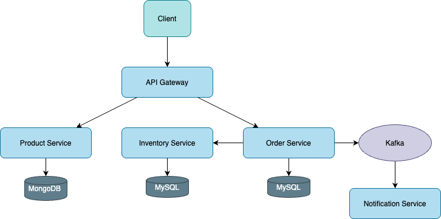

# MicroStore - E-commerce Platform

## Overview

MicroStore is a microservices-based e-commerce platform built using Java, Spring Boot, Spring Cloud, and Angular. It demonstrates both synchronous and asynchronous communication patterns between services.

## Architecture

The architecture of MicroStore is visualized in the `architecture.drawio.png` file.

## Key Technologies

* **Java:** The primary programming language.
* **Spring Boot:** Simplifies building standalone, production-grade Spring applications.
* **Spring Cloud:** Provides tools for building distributed systems (microservices).
* **Angular:** Used for the frontend.
* **Kafka:** Message broker for asynchronous communication.
* **Keycloak:** Identity and Access Management.
* **MySQL:** Database for Order and Inventory services.
* **MongoDB:** Database for Product service.

## Services

* **Product Service:**
    * Manages the product catalog.
    * Allows creation, retrieval, and viewing of product details (name, description, price, images).
    * Database: MongoDB
* **Order Service:**
    * Handles the order lifecycle.
    * Interacts with Inventory Service for stock availability.
    * Interacts with Notification Service to send order confirmations.
    * Database: MySQL
* **Inventory Service:**
    * Manages product stock levels.
    * Processes requests from Order Service to check stock and update inventory.
    * Database: MySQL
* **Notification Service:**
    * Sends notifications (e.g., order confirmations, shipment updates).
    * Decouples notification logic from other services.
